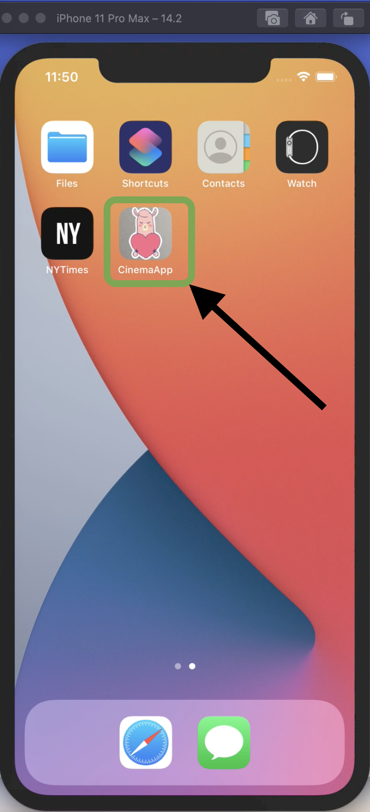
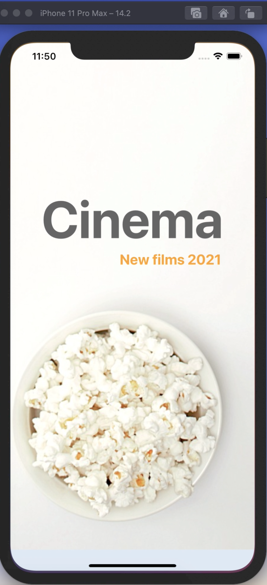
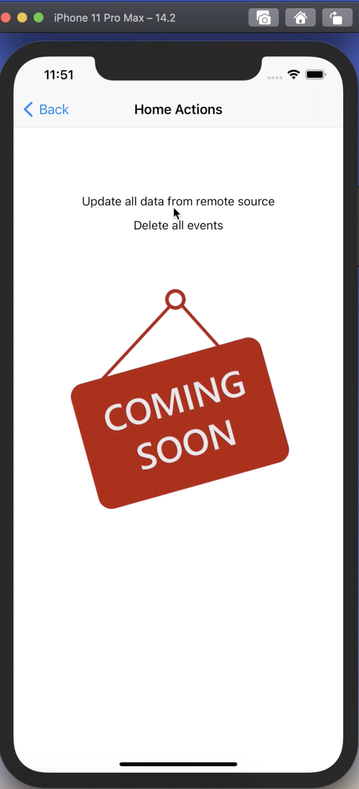
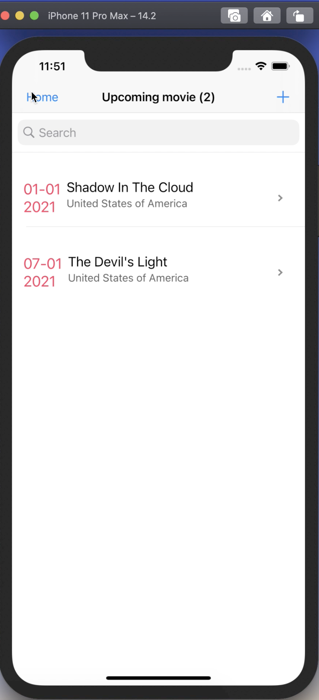
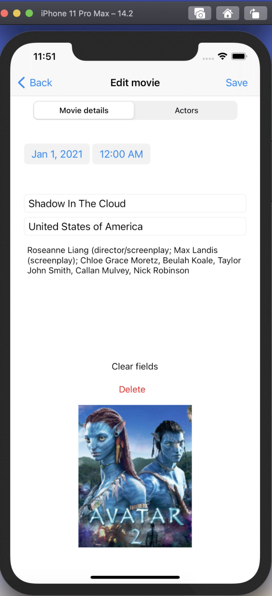
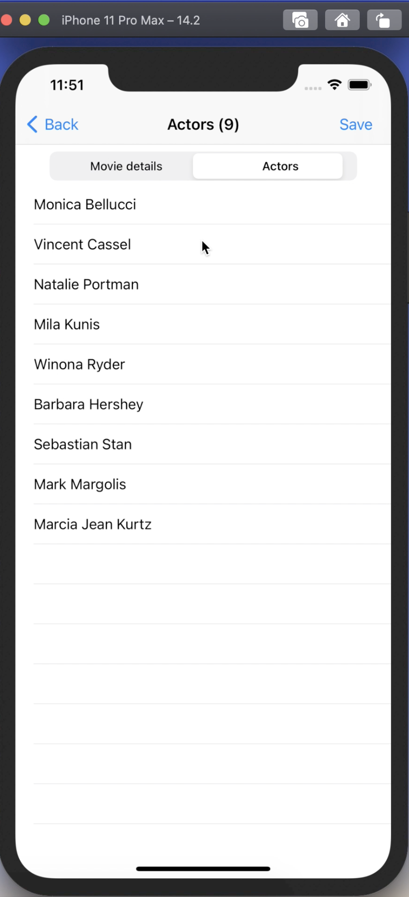
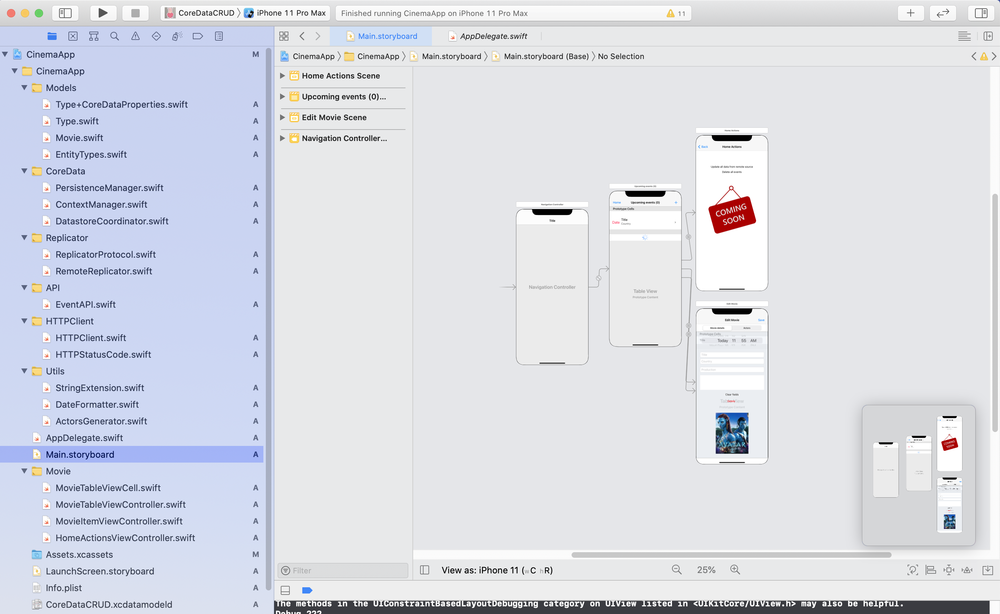
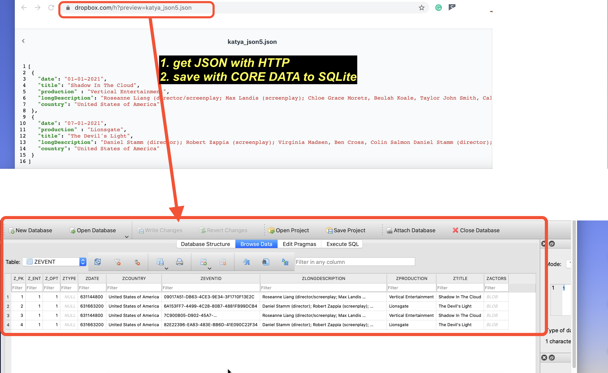
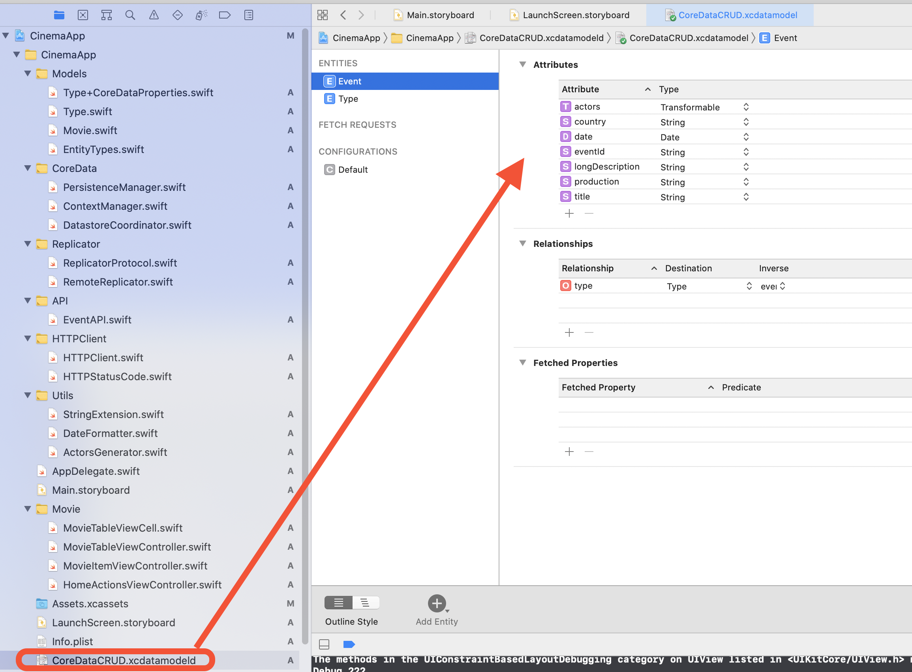

# POSTPONED - only prototype and study
The parser works, but view controllers should be updated and fixed. 

# CinemaApp (JSON PARSER)
IOS Development (Swift Learning) 

- Swift 5.0

The objective for this project is learning Core Data to create Entities and to persist Entities to a SQLite datastore

# SQLite database 
In order to inspect persisted events you can use for example a SQLite database browser to view persisted entries: https://sqlitebrowser.org

The actual path of the SQLite database file will be shown in the Xcode console logger. For example:

/Users/<name>/Library/Developer/CoreSimulator/Devices/<device-uuid>/data/Containers/Data/Application/<application-uuid>/Documents

Select and copy the path that is logged in the Xcode Console (In XCode -> View -> Debug Area -> Activate Console) to SQLite database file.

Go to MacOS Finder, press:SHIFT + CMD + G and paste the logged path to the SQLite database file and click: OK

Finally open the SQLite database file with, for example: SQLite browser

# Screens

